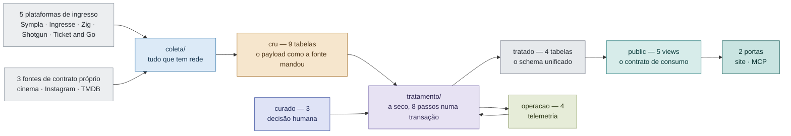
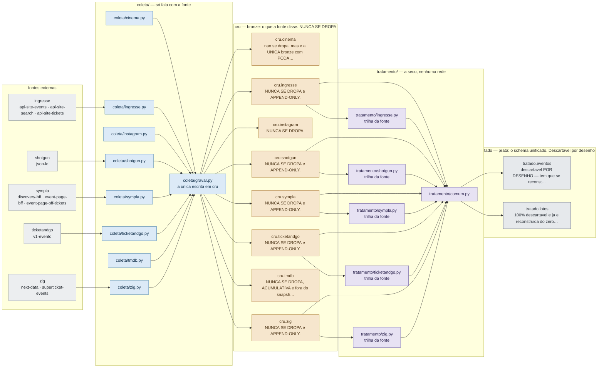
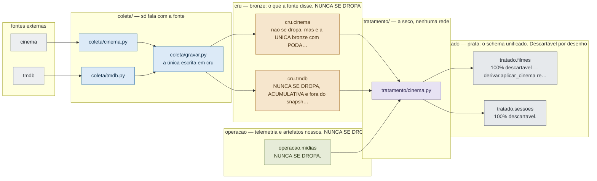
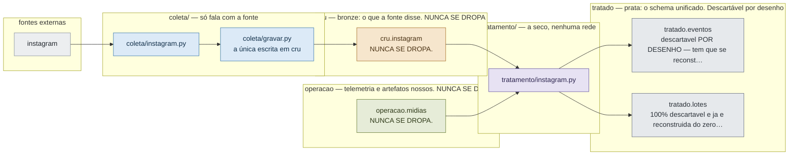
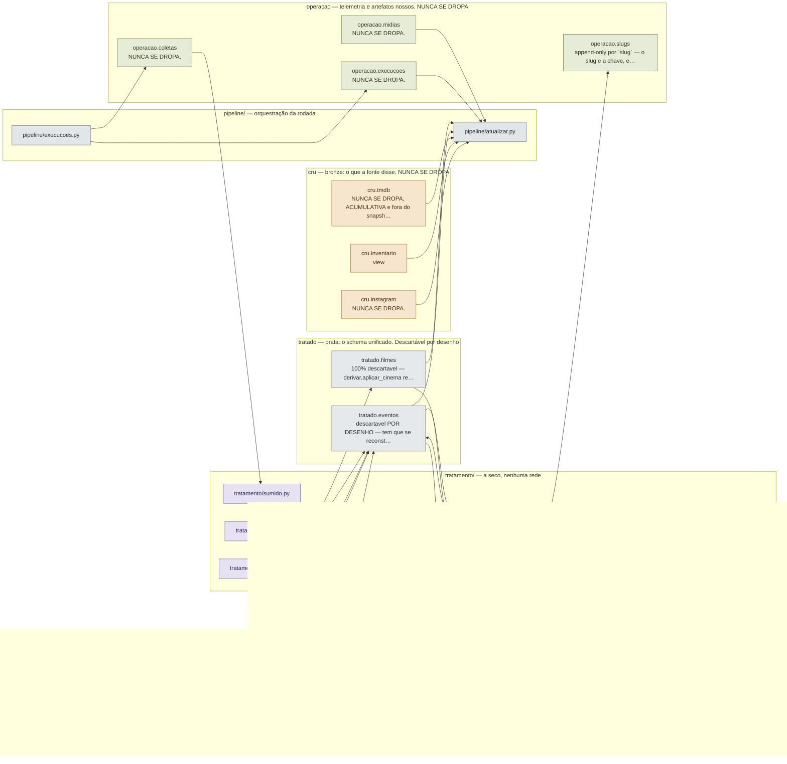
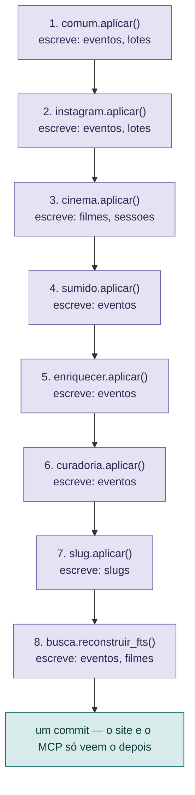

# Linhagem — a trajetória do dado

> **Arquivo gerado. Não edite à mão.** Regrave com
> `python src/ferramentas/linhagem.py` — ele lê o próprio código, então
> fonte nova aparece aqui sozinha. O porquê de ser um gerador e não uma
> ferramenta de prateleira está em
> `docs/pesquisas/20260802_ferramentas-linhagem.md`.

Os diagramas são cortes do MESMO grafo, do mais geral para o mais
detalhado. A cor é a camada; o cinza-azulado à esquerda é sempre o que
está fora daqui.

> Para apresentar, tem o [`linhagem.excalidraw`](linhagem.excalidraw) aqui
> do lado ([prévia](linhagem.png)): as mesmas camadas desenhadas à mão,
> com as caixas arrastáveis. **Ele é um snapshot — não se regenera com
> este arquivo e não acompanha mudança no pipeline.** Em qualquer
> divergência, quem vale é este documento.

## 1. Panorâmica

A regra que o desenho inteiro serve: **tudo que tem rede é coleta e
escreve só em `cru`/`operacao`; tudo que é a seco é tratamento, e ele é o
único que escreve em `tratado`.**

## 2. As plataformas de ingresso

Uma trilha por fonte, e todas desembocam no mesmo motor: o
`tratamento/comum.py` faz o upsert em `tratado.eventos` e agrega os lotes.
O módulo da fonte não sabe SQL — ele só declara como ler o payload dela.

## 3. Cinema

Tratamento do CINEMA: `cru.cinema` (+ `cru.tmdb`, `operacao.midias`) → `tratado.filmes` e `tratado.sessoes`.

## 4. Instagram

Tratamento do INSTAGRAM: `cru.instagram` (post + extração do flyer) → eventos `fonte='instagram'` em `tratado.eventos`.

## 5. Curadoria, telemetria e endereços

O que não vem de fonte nenhuma: a decisão humana (`curado`), o que a
própria rodada registrou sobre si (`operacao`) e o endereço público de
cada registro. É daqui que sai o `sumido` — evento que não reapareceu no
catálogo —, e é por isso que ele depende de `operacao.coletas` ter
registrado uma coleta boa.

## 6. O ciclo do tratamento

O segundo tempo de toda rodada (`tratamento/ciclo.py`), na ordem lida do
código. Roda numa transação só: enquanto reconstrói `tratado`, o site e o
MCP seguem lendo a versão anterior por `public`.

## 7. Trilha por fonte

As colunas de origem dizem qual endpoint produziu cada payload
(`gravar.ERAS`) e o que cada um alimenta.

| fonte | endpoints por origem | bronze | trilha | derivações | lotes |
|---|---|---|---|---|---|
| **sympla** | `catalogo`: discovery-bff, `detalhe`: event-page-bff, `tickets`: event-page-bff-tickets | `cru.sympla` | `tratamento/sympla.py` | catalogo, detalhe | tickets |
| **ingresse** | `catalogo`: api-site-search, `detalhe`: api-site-events, `tickets`: api-site-tickets | `cru.ingresse` | `tratamento/ingresse.py` | detalhe | tickets |
| **zig** | `catalogo`: superticket-events, `detalhe`: superticket-events, `tickets`: next-data | `cru.zig` | `tratamento/zig.py` | catalogo, detalhe | tickets |
| **shotgun** | `catalogo`: json-ld | `cru.shotgun` | `tratamento/shotgun.py` | catalogo | catalogo |
| **ticketandgo** | `catalogo`: v1-evento, `tickets`: v1-evento | `cru.ticketandgo` | `tratamento/ticketandgo.py` | — | tickets |

## 8. Inventário por camada

Cada objeto do DDL, a política declarada no cabeçalho do `.sql` dele e
quem o toca no código. É esta tabela que responde "posso dropar isto?".

Duas leituras do quadro: um módulo que **escreve** numa tabela quase
sempre também a lê, e a coluna "lido por" só lista quem lê SEM escrever;
e as views `cru.<fonte>_atual` — o estado corrente de cada bronze
append-only, por onde o tratamento lê — ficam fora, com as leituras
creditadas à tabela que elas espelham.

### `cru` — bronze: o que a fonte disse. NUNCA SE DROPA

| objeto | tipo | política declarada | DDL | escrito por | lido por |
|---|---|---|---|---|---|
| `cru.cinema` | table | nao se dropa, mas e a UNICA bronze com PODA por desenho — dias que ficaram no passado saem na raspagem. | [sql/cru/cinema.sql](../../sql/cru/cinema.sql) | `coleta/gravar.py` | `tratamento/cinema.py` |
| `cru.ingresse` | table | NUNCA SE DROPA e APPEND-ONLY. | [sql/cru/ingresse.sql](../../sql/cru/ingresse.sql) | `coleta/gravar.py` | `tratamento/comum.py` |
| `cru.instagram` | table | NUNCA SE DROPA. | [sql/cru/instagram.sql](../../sql/cru/instagram.sql) | `coleta/gravar.py` | `tratamento/instagram.py`, `pipeline/atualizar.py` |
| `cru.shotgun` | table | NUNCA SE DROPA e APPEND-ONLY. | [sql/cru/shotgun.sql](../../sql/cru/shotgun.sql) | `coleta/gravar.py` | `tratamento/comum.py` |
| `cru.sympla` | table | NUNCA SE DROPA e APPEND-ONLY. | [sql/cru/sympla.sql](../../sql/cru/sympla.sql) | `coleta/gravar.py` | `tratamento/comum.py` |
| `cru.ticketandgo` | table | NUNCA SE DROPA e APPEND-ONLY. | [sql/cru/ticketandgo.sql](../../sql/cru/ticketandgo.sql) | `coleta/gravar.py` | `tratamento/comum.py` |
| `cru.tmdb` | table | NUNCA SE DROPA, ACUMULATIVA e fora do snapshot de proposito — tratado.filmes/sessoes sao reconstruidas do zero a cada rodada, e o enriquecimento nao p… | [sql/cru/tmdb.sql](../../sql/cru/tmdb.sql) | `coleta/gravar.py` | `tratamento/cinema.py`, `pipeline/atualizar.py` |
| `cru.zig` | table | NUNCA SE DROPA e APPEND-ONLY. | [sql/cru/zig.sql](../../sql/cru/zig.sql) | `coleta/gravar.py` | `tratamento/comum.py` |
| `cru.inventario` | view | — | [sql/cru/zz_views.sql](../../sql/cru/zz_views.sql) | — | `pipeline/atualizar.py` |

### `tratado` — prata: o schema unificado. Descartável por desenho

| objeto | tipo | política declarada | DDL | escrito por | lido por |
|---|---|---|---|---|---|
| `tratado.eventos` | table | descartavel POR DESENHO — tem que se reconstruir a seco a partir do cru. | [sql/tratado/eventos.sql](../../sql/tratado/eventos.sql) | `tratamento/busca.py`, `tratamento/comum.py`, `tratamento/curadoria.py`, `tratamento/enriquecer.py`, `tratamento/instagram.py`, `tratamento/sumido.py`, `ferramentas/linhagem.py` | `tratamento/slug.py`, `pipeline/atualizar.py`, `ferramentas/curar.py` |
| `tratado.filmes` | table | 100% descartavel — derivar.aplicar_cinema reconstroi filmes e sessoes do zero a partir do cru a cada rodada (SNAPSHOT). | [sql/tratado/filmes.sql](../../sql/tratado/filmes.sql) | `tratamento/busca.py`, `tratamento/cinema.py` | `tratamento/slug.py`, `pipeline/atualizar.py` |
| `tratado.lotes` | table | 100% descartavel e ja e reconstruida do zero a cada aplicar() (DELETE + INSERT — por isso sem PK natural). | [sql/tratado/lotes.sql](../../sql/tratado/lotes.sql) | `tratamento/comum.py`, `tratamento/instagram.py` | — |
| `tratado.sessoes` | table | 100% descartavel. | [sql/tratado/sessoes.sql](../../sql/tratado/sessoes.sql) | `tratamento/cinema.py` | — |

### `curado` — o que uma PESSOA decidiu. NUNCA SE DROPA

| objeto | tipo | política declarada | DDL | escrito por | lido por |
|---|---|---|---|---|---|
| `curado.correcoes` | table | NUNCA SE DROPA e APPEND-ONLY. | [sql/curado/correcoes.sql](../../sql/curado/correcoes.sql) | `ferramentas/curar.py` | `tratamento/curadoria.py` |
| `curado.locais` | table | NUNCA SE DROPA. | [sql/curado/locais.sql](../../sql/curado/locais.sql) | `ferramentas/curar.py` | `tratamento/curadoria.py` |
| `curado.pendencias` | view | — | [sql/curado/zz_pendencias.sql](../../sql/curado/zz_pendencias.sql) | — | `tratamento/curadoria.py` |

### `operacao` — telemetria e artefatos nossos. NUNCA SE DROPA

| objeto | tipo | política declarada | DDL | escrito por | lido por |
|---|---|---|---|---|---|
| `operacao.coletas` | table | NUNCA SE DROPA. | [sql/operacao/coletas.sql](../../sql/operacao/coletas.sql) | `pipeline/execucoes.py` | `tratamento/sumido.py` |
| `operacao.execucoes` | table | NUNCA SE DROPA. | [sql/operacao/execucoes.sql](../../sql/operacao/execucoes.sql) | `pipeline/execucoes.py` | `pipeline/atualizar.py` |
| `operacao.midias` | table | NUNCA SE DROPA. | [sql/operacao/midias.sql](../../sql/operacao/midias.sql) | `coleta/gravar.py` | `tratamento/cinema.py`, `tratamento/instagram.py`, `pipeline/atualizar.py` |
| `operacao.slugs` | table | append-only por `slug` — o slug e a chave, entao um endereco nunca "muda de dono" por acidente. | [sql/operacao/slugs.sql](../../sql/operacao/slugs.sql) | `tratamento/slug.py` | — |

### `uso` — quem usou (LGPD). NUNCA SE DROPA

| objeto | tipo | política declarada | DDL | escrito por | lido por |
|---|---|---|---|---|---|
| `uso.acessos` | table | NUNCA SE DROPA; LGPD. | [sql/uso/acessos.sql](../../sql/uso/acessos.sql) | `servico/mcp_server.py` | — |
| `uso.feedback` | table | NUNCA SE DROPA; LGPD. | [sql/uso/feedback.sql](../../sql/uso/feedback.sql) | `servico/feedback.py` | — |
| `uso.usuarios` | table | NUNCA SE DROPA; LGPD. | [sql/uso/usuarios.sql](../../sql/uso/usuarios.sql) | `servico/mcp_server.py` | — |

### `public` — só views: o contrato de consumo

| objeto | tipo | política declarada | DDL | escrito por | lido por |
|---|---|---|---|---|---|
| `public.eventos` | view | — | [sql/public/eventos.sql](../../sql/public/eventos.sql) | — | `servico/consulta.py` |
| `public.filmes` | view | — | [sql/public/filmes.sql](../../sql/public/filmes.sql) | — | `servico/consulta.py` |
| `public.lotes` | view | — | [sql/public/lotes.sql](../../sql/public/lotes.sql) | — | `servico/consulta.py` |
| `public.sessoes` | view | — | [sql/public/sessoes.sql](../../sql/public/sessoes.sql) | — | `servico/consulta.py` |
| `public.slugs_antigos` | view | — | [sql/public/slugs_antigos.sql](../../sql/public/slugs_antigos.sql) | — | `servico/consulta.py` |

## 9. Portas de consumo

Quem lê `public` pela camada canônica (`servico/consulta.py`):

- `api/dados.py`
- `src/servico/mcp_server.py`
